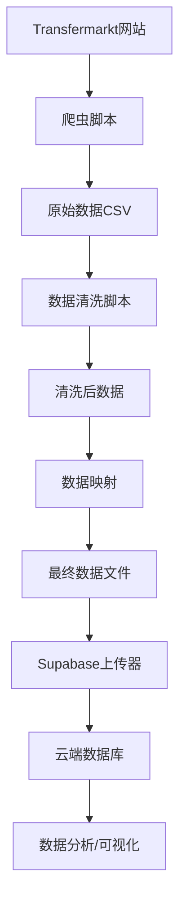

# CSL 2025 中超联赛数据分析项目

## 📊 项目概述

这是一个完整的中超联赛（CSL）2025赛季数据分析项目，包含数据爬取、清洗、处理和云端存储的完整流程。项目涵盖了比赛数据、球队表现、球员统计等多个维度的数据分析和可视化。

## 🎯 主要功能

### 🔍 数据爬取
- **Transfermarkt爬虫**: 自动爬取中超联赛比赛数据
- **多版本爬虫**: 提供不同复杂度的爬虫版本
- **数据验证**: 自动验证爬取数据的完整性

### 🧹 数据清洗
- **智能数据清理**: 自动处理缺失值、重复数据
- **格式标准化**: 统一数据格式和编码
- **数据映射**: 自动匹配球员、球队、位置信息

### 📈 数据分析
- **球员表现分析**: 详细的球员统计数据
- **球队表现分析**: 球队整体表现指标
- **比赛数据分析**: 比赛结果和统计信息

### ☁️ 云端存储
- **Supabase集成**: 自动上传数据到云端数据库
- **批量处理**: 支持大数据量的批量上传
- **实时同步**: 数据更新实时同步到云端

## 📁 项目结构

```
2025 CSL/
├── 📊 数据文件
│   ├── csl_2025_matches_complete.csv      # 完整比赛数据
│   ├── team_list.csv                      # 球队信息
│   ├── soccer_positions_table.csv         # 球员位置映射
│   ├── player performance/                # 球员表现数据
│   │   ├── player_stats_2025.csv          # 本赛季球员表现数据（Supabase使用）
│   │   └── [各球员个人数据文件]
│   ├── team stat/                         # 球队统计数据
│   └── team player/                       # 球队球员信息
│
├── 🕷️ 爬虫脚本
│   ├── csl_2024_final_crawler.py          # 最终版爬虫
│   ├── csl_2024_direct_crawler.py         # 直接爬虫
│   ├── csl_2024_precise_crawler.py        # 精确爬虫
│   └── transfermarkt_crawlers/            # 爬虫工具集
│
├── 🧹 数据清洗脚本
│   ├── clean_player_stats_improved.py     # 改进版数据清洗
│   ├── clean_player_stats_simple.py       # 简化版数据清洗
│   ├── final_cleanup.py                   # 最终清理脚本
│   └── map_positions.py                   # 位置映射脚本
│
├── ☁️ 云端上传
│   ├── supabase_uploader.py              # Supabase上传器
│   ├── setup_supabase.py                 # Supabase设置
│   ├── test_upload.py                    # 上传测试
│   └── quick_start.py                    # 快速开始脚本
│
├── 🗄️ 数据库
│   ├── create_tables.sql                 # 数据库表结构
│   └── config_example.py                 # 配置文件示例
│
└── 📚 文档
    ├── README.md                         # 项目说明（本文件）
    ├── README_Supabase.md               # Supabase详细文档
    └── 使用说明.md                       # 中文使用说明
```

## 🚀 快速开始

### 1. 环境准备

确保您已安装Python 3.8+，然后安装依赖：

```bash
pip install -r requirements.txt
```

### 2. 一键启动（推荐）

运行快速开始脚本，自动完成所有设置：

```bash
python quick_start.py
```

这将自动完成：
- ✅ 安装依赖包
- ✅ 验证数据文件
- ✅ 配置Supabase连接
- ✅ 上传所有数据

### 3. 手动设置（高级用户）

#### 步骤1: 数据验证
```bash
python test_upload.py
```

#### 步骤2: Supabase配置
```bash
python setup_supabase.py
```

#### 步骤3: 开始上传
```bash
python supabase_uploader.py
```

## 📊 数据说明

### 比赛数据 (Matches)
- **文件**: `csl_2025_matches_complete.csv`
- **内容**: 比赛日期、主客队、比分、状态等
- **记录数**: 200+ 场比赛

### 球队数据 (Teams)
- **文件**: `team_list.csv`
- **内容**: 球队ID、球队名称
- **球队数**: 16支中超球队

### 球员表现数据 (Player Performance)
- **文件**: `player performance/player_stats_2025.csv`
- **内容**: 单赛季球员比赛统计（约 1,125 条）
- **指标**: 70+ 个统计指标（与数据库字段一一对应）

### 球队表现数据 (Team Performance)
- **文件**: `team stat/League_Team_Performance.csv`
- **内容**: 球队整体表现指标
- **指标**: 控球率、传球成功率、射门等

## 🛠️ 技术栈

### 后端技术
- **Python 3.8+**: 主要开发语言
- **Pandas**: 数据处理和分析
- **Requests**: HTTP请求处理
- **BeautifulSoup**: HTML解析

### 数据库
- **Supabase**: 云端PostgreSQL数据库
- **SQL**: 数据查询和管理

### 工具库
- **tqdm**: 进度条显示
- **colorama**: 彩色终端输出
- **python-dotenv**: 环境变量管理

## 📈 数据流程



## 🔧 配置说明

### Supabase配置
创建 `config.py` 文件：

```python
SUPABASE_CONFIG = {
    'url': 'https://your-project.supabase.co',
    'service_role_key': 'your-service-role-key'
}

UPLOAD_CONFIG = {
    'batch_size': 1000,
    'max_retries': 3,
    'timeout': 30,
    'log_level': 'INFO'
}
```

### 数据文件映射
```python
DATA_FILES = {
    'positions': 'soccer_positions_table.csv',
    'teams': 'team_list.csv',
    'matches': 'csl_2025_matches_complete.csv',
    'team_performance': 'team stat/League_Team_Performance.csv',
    'player_performance': 'player performance/player_stats_2025.csv'
}
```

## 📊 数据库表结构

### 主要数据表
1. **teams** - 球队信息表
2. **matches** - 比赛数据表
3. **positions** - 球员位置表
4. **team_performance** - 球队表现表
5. **player_performance** - 球员表现表

### 表关系
- `matches` → `teams` (外键关联)
- `team_performance` → `matches`, `teams`
- `player_performance` → `matches`, `positions`

## 🔍 使用示例

### 数据爬取
```python
from csl_2024_final_crawler import CSL2024FinalCrawler

crawler = CSL2024FinalCrawler()
matches = crawler.crawl_all_matches()
```

### 数据清洗
```python
from clean_player_stats_improved import clean_player_stats

cleaned_data = clean_player_stats('raw_data.csv')
```

### 数据上传
```python
from supabase_uploader import SupabaseUploader

uploader = SupabaseUploader()
uploader.upload_all_data()
```

#### 关于列名映射
原始CSV中包含如 "Minutes played"、"Pass Accurate"、"Saves / with reflexes" 等含空格/大小写的列名。上传器会自动映射为下划线命名（如 `minutes_played`、`pass_accurate`、`saves_with_reflexes`），与 Supabase 表结构一致，无需手工改列名。

## 🎯 主要特性

### ✨ 自动化处理
- **一键部署**: 快速开始脚本自动完成所有设置
- **智能重试**: 网络异常自动恢复
- **批量处理**: 大文件自动分批上传

### 🛡️ 数据安全
- **数据验证**: 上传前自动验证数据完整性
- **错误处理**: 完善的异常处理机制
- **日志记录**: 详细的操作日志

### 📈 性能优化
- **内存优化**: 大文件流式处理
- **并发控制**: 合理的请求频率控制
- **缓存机制**: 避免重复处理

## 🔧 故障排除

### 常见问题

**1. 依赖安装失败**
```bash
# 解决方案
pip install --upgrade pip
pip install -r requirements.txt
```

**2. Supabase连接失败**
- 检查URL和Key是否正确
- 确认数据库表已创建
- 检查网络连接

**3. 数据上传失败**
- 查看 `logs/` 目录下的日志文件
- 检查CSV文件格式是否正确
- 验证数据文件是否存在

**4. 爬虫被阻止**
- 调整请求频率
- 更换User-Agent
- 使用代理服务器

### 日志文件
- 位置: `logs/upload_YYYYMMDD_HHMMSS.log`
- 内容: 详细的操作记录和错误信息

## 📚 扩展功能

### 数据分析
- 球员表现趋势分析
- 球队实力对比
- 比赛预测模型

### 可视化
- Power BI报表 (`New folder/GK Analysis.pbix`)
- 数据仪表板
- 交互式图表

### API接口
- RESTful API设计
- 实时数据查询
- 数据导出功能

## 🤝 贡献指南

欢迎提交问题和改进建议！

### 开发环境设置
1. Fork项目
2. 创建功能分支
3. 提交更改
4. 创建Pull Request

### 代码规范
- 使用Python PEP 8规范
- 添加适当的注释和文档
- 编写单元测试

## 📄 许可证

MIT License - 详见 [LICENSE](LICENSE) 文件

## 📞 联系方式

如有问题或建议，请通过以下方式联系：
- 创建Issue
- 发送邮件
- 提交Pull Request

---

**🎉 开始使用：运行 `python quick_start.py` 一键完成所有设置！**

**📖 详细文档：查看 `README_Supabase.md` 和 `使用说明.md` 获取更多信息**

